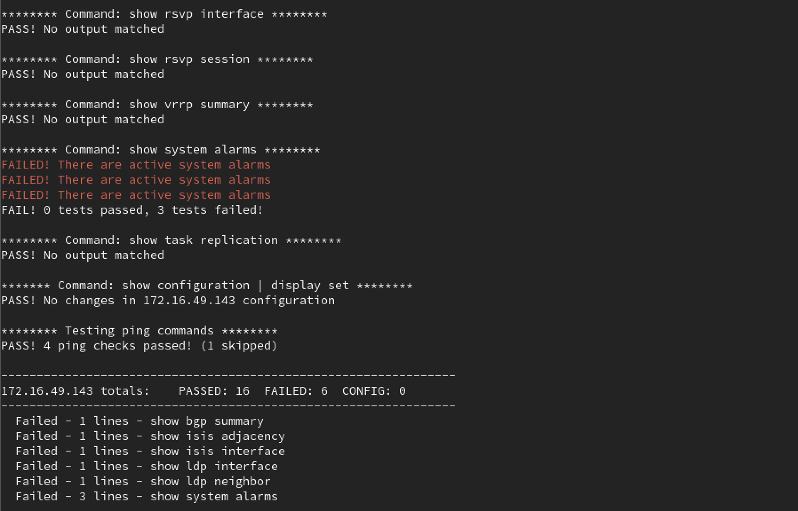

# Baseline Check

This is a set of utilities to help network engineers capture and compare the operational state of network devices before and after making changes.

<br>



<br>

This includes two main parts:

1. baseline_run.py - A script to capture the state of network devices before and after changes are made.  The output is saved to a file in a specified location, and can be used to compare the state of the devices before and after changes are made.

2. baseline_check.py - A script to compare the state of network devices before and after changes are made.  The script will compare the output of commands run on the devices before and after changes are made, and display the differences specified in the test files.


The output files to not nessicarily need to be captured by `baseline_run.py` for them to be checked by `baseline_check.py`.  The output files can be captured manually, or by other means, as long as they have the command output that's needed and in the proper location and naming format.

Baseline_run captures commands with the leading tag [COMMAND] to easily parse the different commands and outputs, but the check script will also look for router prompts and capture the commands that way if needed.


<br>

## Installing

Clone the repo from GitHub

`git clone https://github.com/jtishey/baseline_check.git`

or

`git clone git@github.com:jtishey/baseline_check.git`


### Install Requirements

Python 3.7+ is required and python 3.9+ is recommended.  The script has been tested on RHEL 8 and Rocky 9, but should work on any UNIX-like system with python 3.7+.  Windows is not currently supported.

*Optionally, create a virtual environment to install the requirements in a separate environment.
If youre doing this in a shared environment, where you don't want to source the venv everytime, you will
need to update the shebang line in baseline_run.py and baseline_check.py to point to the python3 binary in the venv.*

```
# Optional: Create a virtual environment
python3 -m venv .venv
source .venv/bin/activate

# Install requirements
python3 -m pip install -r requirements.txt
```


Also optional - create symlinks to the baseline_run.py and baseline_check.py scripts in a directory in your PATH, such as /usr/local/bin, to make them easier to run from anywhere.

```bash
sudo ln -s /path/to/baseline_run.py /usr/local/bin/baseline_run
sudo ln -s /path/to/baseline_check.py /usr/local/bin/baseline_check
```

<br> 


### Setup config.yml


Modify the configuration file `config.yml` located in ./baseline_check/src/configs/config.yml to set up project parameters such as project_path, mop_path, max_queue, max_threads, snmp_community, and snmp_version.  Alternative config files can be specified using the `-f/--file <CONFIG_FILE>` option.


| Parameter    | Description                                   |
|--------------|-----------------------------------------------|
| project_path| This is the base location                      |
| mop_path     | Where pre/post state captures should be saved |
| max_queue    | The depth of the multithreading queue         |
| max_threads  | How many baselines can be captured at a time  |
| snmp_community | Specify the SNMP community string for devices|
| snmp_version | SNMP Version, default is 2/2c                 |
| ping_targets | List of IP addresses to ping for connectivity tests |


### Network Credentials

Modify the `get_credentials()` function in `src/utils/baseline_utils.py` to return the correct credentials for the network devices you are testing against.
The function should return a dictionary with the following keys: `username`, `password`


### Network Device Types

You can also modify the `get_os` function in `src/utils/baseline_utils.py` to return the correct device type for the network devices you are testing against.
The function should return a string with the device type in Netmiko format (cisco_ios, juniper_junos, etc.)

The get_os function will try using SNMP to determine the device type, using the following settings from config.yml
 - snmp_community
 - snmp_version


<br>

## Usage

In the examples below, we are going to assume a MOP/Change ID of `123456` and devices named `router1` and `router2`.

Capture the state of `router1` and `router2` before making changes under change ID `123456`.  This will store the output from the commands needed by the testfiles in the `mop_path` specified in `config.yml`  (default is `./baseline_check/src/mops/`)

```
./src/baseline_run.py -m 123456 -d router1,router2 -k before
```

Capture the state again after making changes.

```
./src/baseline_run.py -m 123456 -d router1,router2 -k after
```

Example of the output files:


```
(.venv)» head -n 20  ./src/mops/2024/03_Mar/01_03_2024/123456/123456_router1_after_log

[DEVICE] router1
[KEYWORD] after
[MOP] 123456
[DEVICE_TYPE] juniper_junos
[BASE_PROMPT] guest@vSRX1


[COMMAND] show bfd session

0 sessions, 0 clients
Cumulative transmit rate 0.0 pps, cumulative receive rate 0.0 pps


[COMMAND] show chassis fpc
                     Temp  CPU Utilization (%)   CPU Utilization (%)  Memory    Utilization (%)
Slot State            (C)  Total  Interrupt      1min   5min   15min  DRAM (MB) Heap     Buffer
  0  Online          -------------------- CPU less FPC --------------------

<...>

```


Run the check script to compare any state differences between the before/after output.  

*NOTE: The following combinations will be picked up automatically by baseline_check: before/after, pre/post, or baseline/verification.  If other keywords are used, they weill need to be specified in baseline_check.py using the `-b/--before <KEYWORD>` and `-a/--after <KEYWORD>` options.  Optionally, they can be added to the `config.yml` file.*

```
baseline_check -m 123456
```


### Example Output

```
Found /opt/scripts/baseline_check/src/mops/2024/03_Mar/01_03_2024/123456

Running router1:
----------------------------------------------------------------
******** Command: show bfd session ********
PASS! No output matched

******** Command: show bgp summary ********
FAIL! No output matched for show bgp summary

******** Command: show chassis fpc ********
PASS! All 1 tests passed!

******** Command: show interfaces terse ********
PASS! All 5 tests passed!

******** Command: show ipv6 neighbors ********
PASS! No output matched

******** Command: show isis adjacency ********
FAIL! No output matched for show isis adjacency

******** Command: show isis interface ********
FAIL! No output matched for show isis interface

******** Command: show ospf neighbor ********
PASS! No output matched

******** Command: show l2circuit connections ********
PASS! No output matched

******** Command: show ldp interface ********
FAIL! No output matched for show ldp interface

******** Command: show ldp neighbor ********
FAIL! No output matched for show ldp neighbor

******** Command: show ldp session ********
PASS! No output matched

******** Command: show pim interfaces ********
PASS! No output matched

******** Command: show pim neighbors ********
PASS! No output matched

******** Command: show route summary ********
PASS! All 2 tests passed!

******** Command: show rsvp interface ********
PASS! No output matched

******** Command: show rsvp session ********
PASS! No output matched

******** Command: show vrrp summary ********
PASS! No output matched

******** Command: show system alarms ********
FAILED! There are active system alarms
FAILED! There are active system alarms
FAILED! There are active system alarms
FAIL! 0 tests passed, 3 tests failed!

******** Command: show task replication ********
PASS! No output matched

******* Command: show configuration | display set ********
PASS! No changes in router1 configuration

******** Testing ping commands ********
PASS! 4 ping checks passed! (1 skipped) 

----------------------------------------------------------------
router1 totals:    PASSED: 16  FAILED: 6  CONFIG: 0
----------------------------------------------------------------
  Failed - 1 lines - show bgp summary
  Failed - 1 lines - show isis adjacency
  Failed - 1 lines - show isis interface
  Failed - 1 lines - show ldp interface
  Failed - 1 lines - show ldp neighbor
  Failed - 3 lines - show system alarms

```

<br>

## CLI Options

```
Required arguments:
-m <MOP>        Specify a MOP number or tag to locate the baseline files for and run checks against

Optional arguments:
-a <PRE>        Keyword to identify "After" files (default=after)
-b <POST>       Keyword to identify "Before" files (default=before)
-d <DEVICE>     Run baseline checks on a specific device(s) only
-f, --file      Specify a custom config file (default=config.yml)
-o, --override  Ignore previous log files and force new check

Output Modes:
-c, --config     Display configuration diffs only
-l, --log        Display no output, only log to file
-q, --quiet      Display only Failed tests
-s, --summary    Display summary output only
-v, --verbose    Display verbose output (All test results)
```


By default, only "FAILED" test results are displayed, and only a MOP/Change number is required.

`$ baseline_check -m 123456`

If before/after keywords other than 'before' & 'after' have been specified when running baseline_run, those must also be specified:

`$ baseline_check -m 123455 -b first -a last`


To display details for all tests ("PASSED" & "FAILED"), use verbose flags:

`$ baseline_check -m 123456 -v`

For large MOPs, you may want to run tests on a specific device(s), to do this use the -d option:
```
$ baseline_check -m 123456 -d router1
$ baseline_check -m 123456 -d router2, router3
```

Once the script is run, subsequent runs will be based on the log file from the first run.
To override this and run the checks again, use the -o option:

`$ baseline_check -m 123456 -o`


## Log File

A log file is created in the MOP baseline folder containing the verbose output on each run.Example:

`./Year_2017/Sep_01/123456/BaselineCheck.log`
 

## Test Files

Except for config diff and ping tests, all tests are based on testfiles specified by `config.yml`
By default, the testfiles are located in `./src/testfiles/' in a separate folder for each OS Type:

  - juniper_junos
  - cisco_ios
  - cisco_xr
  - nokia_sros
  - nokia_mdcli

They are YAML files and are currently setup as follows:

juniper_junos/test_isis_adjacency.yml:

```---
1|- show_isis_adjacency:
2|  command: show isis adjacency
3|  ignore-null: False
4|  iterate: [all]
5|  blacklist: [Interface, '^', error]
6|  tests:
7|  - no-diff: [0, 1, 3]
8|    info: "PASSED! ISIS adj to {{ pre[1] }} on {{ pre[0] }} is still {{ pre[3] }}"
9|    err: "FAILED! ISIS adj to {{ pre[1] }} on {{ pre[0] }} was {{ pre[3] }} and is now {{ post[3] }}"
```

  - Line #1 is an arbitrary test name - doesn't really matter what it is.
  - Line #2 is the command you want to match on from the baseline files.
  - Line #3 tells the script what to do if no output is found for the command.  Set to True if you want to PASS if there's no output, or False if you want the test to FAIL on no output.
  - Line #4 can be "[all]" to iterate over all lines in the command output, or a list of specific values to match. For example, if you only want to check lines that contain the words "UP" or "DOWN" in them, use ['UP', 'DOWN']
  - Line #5 is the opposite of Line #4, ignore any lines with the specified words int them. NOTE: Special characters should be in 'quotes'.
  - Line #6 is just a header for the test section of the file
  - Line #7 is the type of test to run and the fields to test. Currently supported tests are "no-diff" and "delta"
    no-diff is considered a pass if all specified indexes match in the before and after baseline. The test fails if any of the indexes change. The first index in the list is considered the line identifier and should be unique.
    delta expects the index of a numerical value, and an amount of variance allowed between before and after. For example: "delta: [0, 0.01]" means index 0 should not change more than 1%.
    Indexes are words in each line of output, separated by spaces. In a line "ge-0/0/0 router1 UP 00:00:12" 0 = "ge-0/0/0" 1 = "router1" 2 = "UP" etc.
  - Line #8 is the message to be displayed if the test is passed. This line uses Jinja2 to insert variables. For example, "{{ pre[0] }}" will be replaced with the value of index 0 of the "before" baseline line, {{ post[0] }} is index 0 of the after baseline line.
  - Line #9 is the message to be displayed if the test fails. This line uses Jinja2 templating as well.
 
Once a testfile is created, it must be added to `config.yml` to be run.  Alternatively, a separate config file can be created and specified with the '-f <FILE>' option when running the script.  This can be useful for running custom testfiles, or only a specific list of testfiles.

Additionally, ping tests and configs are checked for differences before/after without requiring a test file.  Add additional ping targets to `config.yml` to test connectivity to other devices.  The config diff test will compare the running config of the device before and after the change.


